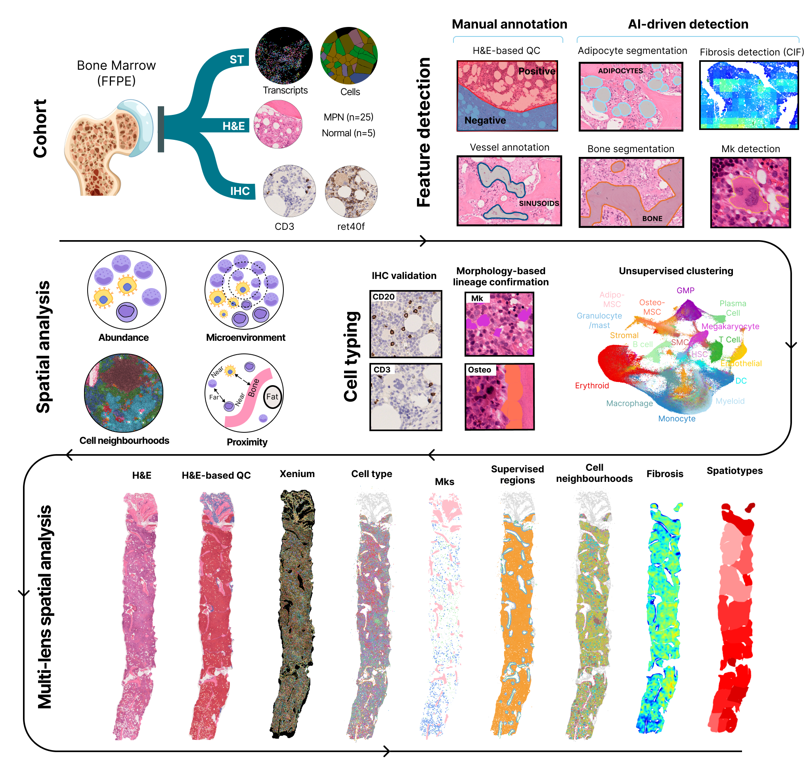

# MarrowMap: Redefining the topology of the human bone marrow using augmented spatial transcriptomic analysis

This repository contains code scripts used in the study: **"Redefining the topology of the human bone marrow using augmented spatial transcriptomic analysis"** The study uses image-based spatial transcriptomics data coupled with AI-driven features (structural componets) to define the topology of the normal bone marrow (BM) and BM in myeloproliferative neoplasms (MPNs). A high-level overview of the cohort and analyses conducted is provided in the study workflow figure below. 




## Repository Contents
- **Code Scripts:** Scripts used for data loading, preprocessing, and analysis. 
- **Analysis Outputs:** Where possible we showed the Figures reported in the Manuscript in R or Python Notebooks.

### Usage

#### Step 1: Read Xenium runs data as spatial data object
````python
/workflow/1_xenium_to_sdata/xen_to_sdata.py
````
#### Step 2: Quality Control (removing spatially or morphologically unpreserved, low-transcript cells)
Run the following notebooks
````python
/workflow/2_quality_control/artefact_filtering.ipynb
/workflow/2_quality_control/spatial_preservation.ipynb
````
#### Step 3: Cell annotation
Run the R scripts in the folder `/workflow/3_cell_annotation`. Details about script order is provided in the help file inside the folder.

#### Step 4: Analyses

##### Identifying cell neighbourhgood
- Construct graph representation by running the following script:
````python
workflow/4_analysis/cell_charter/graph_construction.py
````
- Validating graph connectivity and comparision with other graph construction approaches
 ````python
workflow/4_analysis/cell_charter/graph_construction_approaches_comparisions.ipynb
````
##### Abundance Analysis
Run the following notebooks
 ````python
/workflow/4_analysis/cell_lineages_abundance/abundance_plot_fig1.ipynb
/workflow/4_analysis/cell_lineages_abundance/cell_types_viz_trephine.ipynb
````

##### Spatial Analysis (Point Pattern)
Run the script inside the distance map folder to compute distance matrix and then for each structure to other structure run the corresponding script. 

##### Visualization of niches
Run the following notebooks
 ````python
/workflow/4_analysis/spatial_analysis/visualize_niches.ipynb
/workflow/4_analysis/spatial_analysis/interactions_rank.py
````

##### Spatiotypes Analysis
The spatiotypes analysis was done using band descriptor.
Run the following scripts in order
 ````python
/workflow/4_analysis/spatioytypes/compute_band_descriptors.py
/workflow/4_analysis/spatioytypes/cluster_descriptors.py
/workflow/4_analysis/spatioytypes/spatiotypes_viz_trephine.ipynb
````
Run the R notebook to visualize the spatiotypes spatial cellular abundance
````
/workflow/4_analysis/spatioytypes/spatiotypes_defination.Rmd
````

##### Multiple Instance Learning Model
Run the following scripts in order
 ````python
/xenium_paper/workflow/5_MIL/main.py
/workflow/5_MIL/visualization/MIL_figures.ipynb
````
For visualizing intra- and inter- samples hetrogenity using Circos plot

```
/workflow/5_MIL/visualization/circos_plots.Rmd
```

## Citation

If you use this repository, please cite our preprint:

> [Redefining the topology of the human bone marrow using augmented spatial transcriptomic analysis](https://www.biorxiv.org/content/10.1101/2024.06.23.600257v1)

## License

The source code in this repo is released under the MIT-CC-Non-Commercial license. For external packages (CellCharter, BandDescriptor, ESIML) please refer to check corresponding code repositories.

---

For more information, please refer to the [preprint](https://www.biorxiv.org/content/10.1101/2024.06.23.600257v1).
